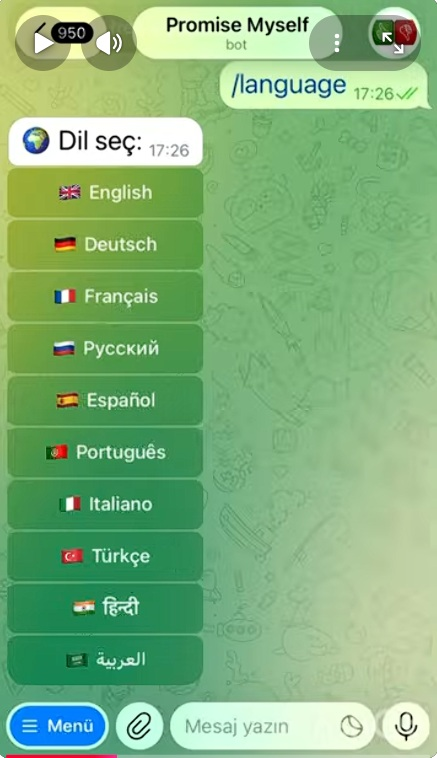
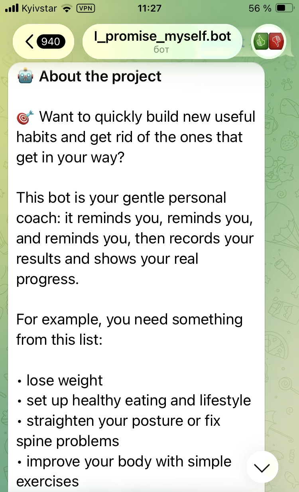
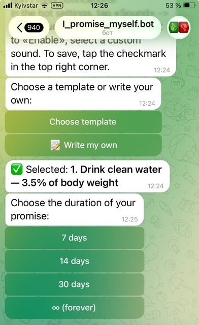
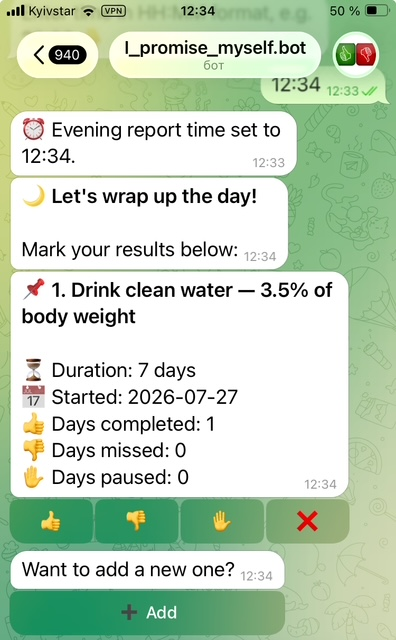
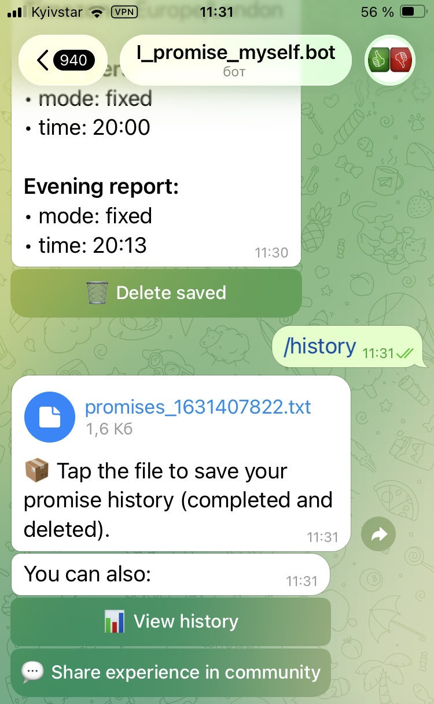

# 🤖 Promise Bot — Multi-language Habit Tracker

A Telegram bot for tracking and breaking bad habits, building new useful habits and skills, with support for 6+ languages.

👉 **[Try the bot: @I_promise_myself_bot](https://telegram.me/I_promise_myself_bot)**

---

## 🌍 LANGUAGES / ЯЗЫКИ

| Code | Language | Flag |
| :--- | :--- | :--- |
| `en` | English | 🇬🇧 |
| `de` | Deutsch | 🇩🇪 |
| `fr` | Français | 🇫🇷 |
| `es` | Español | 🇪🇸 |
| `pt` | Português | 🇵🇹 |
| `ru` | Русский | 🇷🇺 |

*+ new languages under development*

---

## 📋 DESCRIPTION

**Promise Bot** helps eliminate negative habits and build useful ones through:

- ✅ Subscription with a trial period
- ✅ Daily reminders (throughout the day / report)
- ✅ Flexible settings (timezone, time, and frequency of reminders)
- ✅ Progress tracking
- ✅ Charts and statistics

### What can this bot do?

🎯 Want to quickly build new useful habits and get rid of the ones that get in your way?

This bot is your gentle personal coach: it reminds you, reminds you, and reminds you, then records your results and shows your real progress.

For example, you need something from this list:

- lose weight
- set up healthy eating and lifestyle
- straighten your posture or fix spine problems
- improve your body with simple exercises
- increase personal energy and stress resilience
- attract good luck
- develop intuition
- drastically reduce the manifestation of negative emotions like fear, anger, insecurity, etc.
- find all your bad habits and gradually get rid of them
- and many other useful tasks.

You even know what needs to be done, but you just can't turn it into a system so that it works on autopilot.

✨ How the bot works:

- ✅ To build a skill, add up to 5 simple promises that will help improve yourself.  
- ⏰ Throughout the day at any time and with any frequency, the bot will remind you of all your promises. 
- ✍️ And in the evening it asks for a report: 👍 done / 👎 not done / ✋ pause.
- 📊 Shows real progress in numbers and compiles a history of promises. 

🔑 Why it works:

80% of success is starting, remembering, and tracking new habits.
The other 20% is regularly taking real actions to fulfill them.

At first it takes effort, then new habits run on autopilot, and you add new goals. And you continuously improve yourself this way.

🙌 This bot won't judge or pressure you. Missed a day — no worries, just keep going. The goal is gentle support and daily accountability!

🚀 Start now — add your first 5 habits and take a step toward a new version of yourself.

---

## ⏳ HOW LONG DOES REAL CHANGE TAKE?

New mindset – 1 day.
New habit – 21 days.
New skill – 90 days.
New body – 180 days.
New life – 365 days.
A new you – 1095 days.

Use the bot regularly, and you'll succeed!

---

## 🛠 TECH STACK

- **Backend:** Python 3.13, aiogram 3.x
- **Database:** PostgreSQL via Supabase
- **Payments:** Paddle (Merchant of Record)
- **Hosting:** DigitalOcean VPS (systemd services)
- **i18n:** Custom translation layer, 6 languages

---

## 🔑 MAIN COMMANDS

| Command | Description |
| :--- | :--- |
| `/start` | Main menu |
| `/instruction` | How to use the bot |
| `/community` | Our community |
| `/pricing` | Choose a subscription |
| `/language` | Change language |
| `/add_promise` | Add a new promise |
| `/my_promises` | My promises |
| `/set_timezone` | Set timezone |
| `/set_reminder_time` | Set reminder time and frequency |
| `/set_evening_time` | Set evening report time |
| `/show_saved_times` | View saved times |
| `/about` | About the project |
| `/help` | Help |
| `/history` | Download/View history |

---

## 📊 STATISTICS

| Metric | Description |
| :--- | :--- |
| `done_count` | Days completed |
| `skip_count` | Days skipped |
| `pause_count` | Days on pause |
| `completed_days` | Total days completed |

---

## 📝 LICENSE

Copyright © 2026 intro773-ctrl. All rights reserved.

---

## 📞 CONTACTS

- **Website:** https://promise-myself.tilda.ws/
- **Telegram Bot:** @I_promise_myself_bot (https://telegram.me/I_promise_myself_bot)
- **Support:** @PromiseMyself_Support

---

## 📸 SCREENSHOTS

  
  
  
  
  

📸 [See more screenshots →](docs/screenshots.md)
